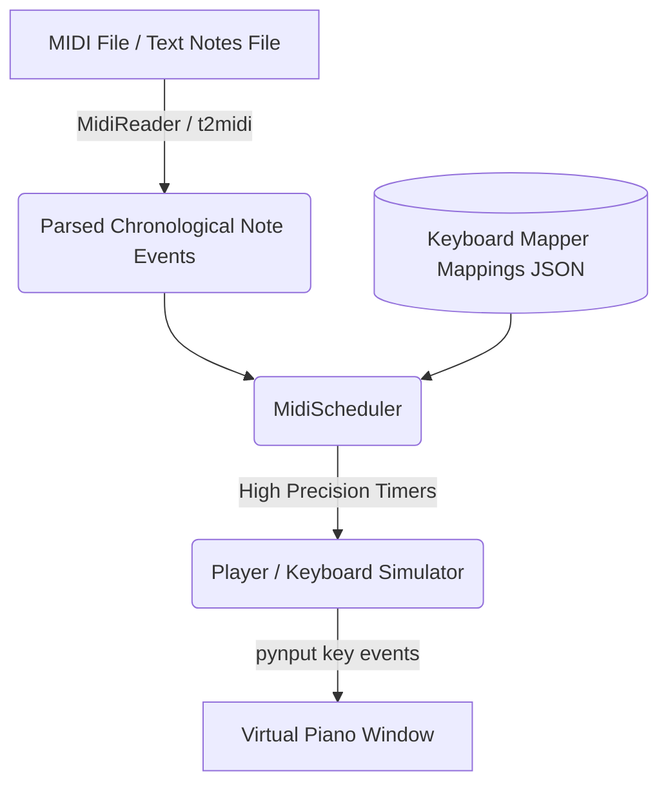

# 🎹 Auto Piano Player

An automated, high-precision MIDI playback engine that simulates keyboard inputs to play virtual pianos. It parses MIDI files, maps notes to keyboard keys, and schedules them with millisecond accuracy.

---

## 🚀 Key Features

* **Tkinter GUI Console**: User-friendly control panel to load MIDIs, adjust speed, transpose notes, set start delay, and monitor real-time playback progress on a seeking-enabled progress bar.
* **Millisecond-level Precision**: Utilizes Windows high-resolution system timers (`ctypes`) to prevent timing drift and ensure rhythmically accurate playbacks.
* **Simultaneous Key Press (Chord Support)**: Correctly clusters note events occurring at the exact same timestamp to press/release keys concurrently rather than sequentially.
* **Global Hotkey Integration**: Control the player on-the-fly (even when the app window is backgrounded) with global keyboard shortcuts (`F6` - `F11`, `ESC`).
* **Interactive Calibrator**: Calibrate custom layouts interactively to map MIDI note integers to keyboard keys and store them in JSON format.
* **Text-to-MIDI Conversion**: Convert sequences of text-based notes (e.g., `A5 F5 D5 C5`) into fully functional MIDI files.

---

## 🛠️ Architecture & Flow

The project is designed with a highly modular and decoupled architecture to allow future expansion (e.g., video capture, audio pitch detection) without modifying the playback engine.



### Module Responsibilities

* **`main.py`**: Initializes components, runs the GUI, handles user settings, and starts the global hotkeys listener.
* **`midi_reader.py`**: Parses `.mid` and `.midi` files using `mido`, extracting notes, velocity, absolute play timestamps, and tempos.
* **`scheduler.py`**: The playback engine that handles timing, tempo changes, pause/resume/stop actions, and seeking.
* **`player.py`**: Simulates actual keyboard key presses and releases using `pynput`.
* **`mapper.py`**: Converts MIDI note values (e.g. `60`) to keys mapped for the target virtual piano.
* **`calibrator.py`**: Provides UI flow to let users interactively press the keys for mapping and exports to JSON.
* **`utils.py`**: Configures logger settings and invokes native Windows API to request high-precision timers.
* **`config.py`**: Manages reading and saving user preferences (`config.json`).
* **`t2midi.py`**: Parses text-based notes inside `.txt` files to output executable `.mid` files.

---

## 📦 Getting Started

### Prerequisites
* **OS**: Windows (highly recommended for `ctypes` high-resolution timer support).
* **Python**: Python 3.8 or above.

### Installation

1. **Clone the repository**:
   ```bash
   git clone https://github.com/your-username/auto-piano-player.git
   cd auto-piano-player
   ```

2. **Install dependencies**:
   ```bash
   pip install -r requirements.txt
   ```

3. **Run the application**:
   ```bash
   python main.py
   ```

---

## 🎮 Usage Guide

### Playback Control
1. Launch the application.
2. Click **Load MIDI** (or press `F6`) to select a MIDI file.
3. Configure settings like **Speed Multiplier**, **Transposition** (in semitones), and **Start Delay** (time to click/focus your virtual piano window before playback starts).
4. Click **Play** (or press `F7`) to start.

### ⌨️ Global Hotkeys Reference
Global hotkeys work backgrounded so you can focus on the virtual piano window:

| Hotkey | Action |
| :---: | :--- |
| **`F6`** | Load MIDI file |
| **`F7`** | Play playback |
| **`F8`** | Pause playback |
| **`F9`** | Stop playback |
| **`F10`** | Decrease speed (-0.1x) |
| **`F11`** | Increase speed (+0.1x) |
| **`ESC`** | Exit application (when window is focused) |

### 🛠️ Calibration Mode
If using a custom virtual piano layout:
1. Open the mapper / calibration panel.
2. Follow the prompt to press the keyboard keys matching the corresponding MIDI note pitches.
3. Your mapping configuration will save inside `mappings/virtual_piano.json` or custom files.

### 📝 Convert Text Notes to MIDI
If you have written notes (e.g. `C4 D4 E4 G4 A4`) in a text file:
1. Run the converter:
   ```bash
   python t2midi.py
   ```
2. Choose your `.txt` note file.
3. A `.mid` file with 16th-note timing at 120 BPM will be exported in the same directory.

---

## 📂 Project Structure

```
AutoPiano/
│
├── main.py                # Main GUI & controller
├── midi_reader.py         # MIDI parser
├── player.py              # Keyboard simulator
├── mapper.py              # Key-to-Note mapper
├── calibrator.py          # Calibration assistant
├── scheduler.py           # Playback scheduler
├── config.py              # Configuration manager
├── utils.py               # Timer precision & logger utils
├── t2midi.py              # Text to MIDI utility converter
│
├── mappings/              # Keyboard layouts (JSON)
│   └── virtual_piano.json
│
├── midis/                 # Directory to keep MIDI files
│
├── presets/               # Configuration presets
│
└── requirements.txt       # Dependencies
```

---

## 🔮 Future Expansion

The modular pipeline permits slotting in alternative note-event generators:
* **Synthesia Video Reader**: Screen capture + note color detection to trigger inputs.
* **Sheet Music OCR**: Visual parsing of sheet music to output playback notes.
* **Audio-to-MIDI**: Audio pitch detection in real-time.
* **Live MIDI Input**: Hooking up physical MIDI keyboards to trigger virtual key presses.

---

## 📄 License

This project is licensed under the MIT License.
